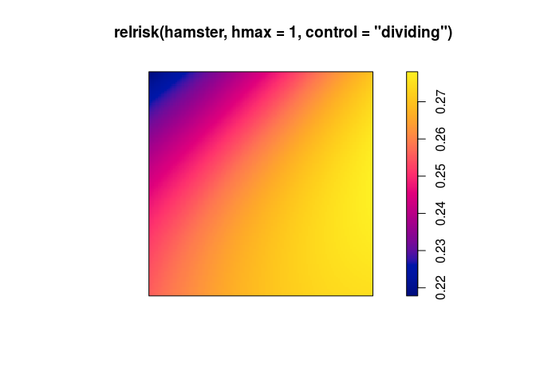
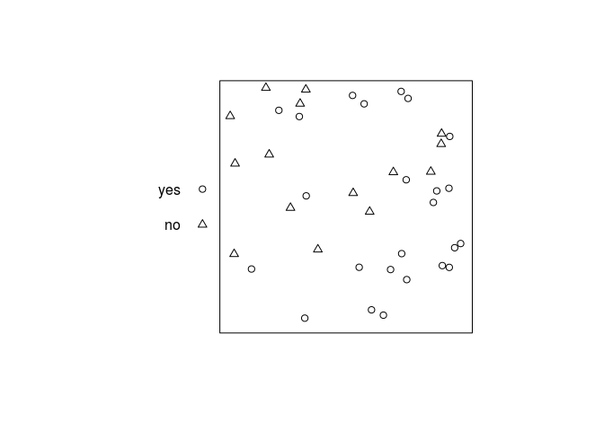
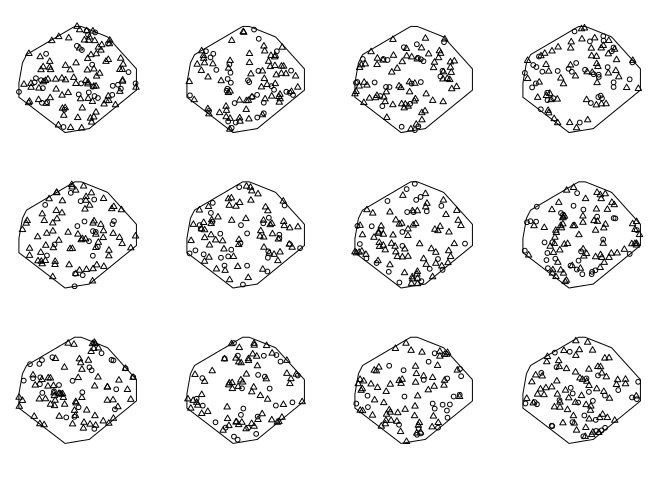

Lab 5: Marked point patterns
================

This session covers modelling of marked point patterns using marked point processes.
The lecturer's R script is [available here](https://raw.githubusercontent.com/spatstat/SSAI2017/master/Scripts/script05.R) (right click and save).

``` r
library(spatstat)
```

### Exercise 1

The dataset `spruces` contains the Norwegian Spruces dataset giving the locations of trees and their diameters at breast height.

1.  Read the help file for the data;

2.  access the dataset and plot it;

``` r
plot(spruces)
```


1.  re-plot the data so that the tree diameters are displayed at a physical scale that is 10 times the physical scale of the location coordinates.

``` r
plot(spruces, markscale = 10)
```


1.  use `Smooth` (notice the upper case S) to compute and plot a pixel image of the local average tree diameter;

``` r
plot(Smooth(spruces, sigma = 8))
```


1.  trees are normally classified as ‘adult’ when their diameter exceeds 30 centimetres. Use the `cut` command to classify each tree as adult or juvenile, and produce a multitype point pattern in which the trees are marked as adult or juvenile. Plot this pattern, and plot the adults and juveniles separately.

``` r
cutspruces <- cut(spruces, breaks = c(0,0.3,0.4), labels = c("juvenile", "adult"))
plot(cutspruces, main = "")
```


``` r
plot(split(cutspruces), main = "")
```


### Exercise 2

The file `anthills.txt` is available in the Data directory on [github](https://github.com/spatstat/SSAI2017) and downloadable by [this direct link](https://raw.githubusercontent.com/spatstat/SSAI2017/master/Data/anthills.txt) (right click and save).

It records the locations of anthills recorded in a 1200x1500 metre study region in northern Australia. Coordinates are given in metres, along with a letter code recording the ecological ‘status’ of each anthill.

1.  read the data into `R` as a data frame, using the `R` function `read.table`. (Since the input file has a header line, you will need to use the argument `header=TRUE` when you call `read.table`.)

``` r
dat <- read.table(file = "../Data/anthills.txt", header = TRUE)
```

1.  check the data for any peculiarities.

2.  create a point pattern `hills` containing these data. Ensure that the marks are a factor, and that the unit of length is given its correct name.

``` r
hills <- with(dat, ppp(x, y, xrange = c(0, 1200), yrange = c(0, 1500),
                       marks = status, units=c("metre", "metres")))
```

1.  plot the data.

``` r
plot(hills, main = "")
```


### Exercise 3

The dataset `hamster` is a multitype pattern representing the locations of cells of two types, *dividing* and *pyknotic*.

1.  plot the data;

``` r
plot(hamster)
```


1.  plot the patterns of pyknotic and dividing cells separately;

``` r
plot(split(hamster), main = "")
```


1.  plot kernel estimates of the intensity functions of pyknotic and dividing cells separately;

``` r
plot(density(split(hamster)), main = "")
```


1.  use `relrisk` to perform cross-validated bandwidth selection and computation of the relative intensity of pyknotic cells.

``` r
plot(relrisk(hamster, casecontrol=FALSE, hmax = 1))
```



### Exercise 4

The command `rmpoispp` generates simulated realisations of a *multitype* Poisson process. The first argument `lambda` specifies the intensity function *λ*(*x*, *y*, *m*) which gives the intensity of points at location (x,y). It may be given in several forms.

1.  If `lambda` is a single number, it specifies the intensity of points *of each type*. Try computing, inspecting and plotting the result of

    ``` r
    rmpoispp(21, win=square(1), types=c("yes", "no"))
    ```

    What is the expected total number of points generated by this command?

``` r
X <- rmpoispp(21, win=square(1), types=c("yes", "no"))
summary(X)
```

    ## Marked planar point pattern:  41 points
    ## Average intensity 41 points per square unit
    ## 
    ## Coordinates are given to 8 decimal places
    ## 
    ## Multitype:
    ##     frequency proportion intensity
    ## yes        19  0.4634146        19
    ## no         22  0.5365854        22
    ## 
    ## Window: rectangle = [0, 1] x [0, 1] units
    ## Window area = 1 square unit

``` r
plot(X, main = "")
```



We expect 2 × 21 = 42 points on average.

1.  If `lambda` is a vector of numbers, the vector entries specify the intensities for each type of point. Try

    ``` r
    rmpoispp(c(20,40,20), types=letters[1:3])
    ```

    What is the expected total number of points generated by this command?

``` r
rmpoispp(c(20,40,20), types=letters[1:3])
```

We expect 20 + 40 + 20 = 80 points on average in this case.

1.  If `lambda` is a function with arguments `x,y,m` then this is interpreted as the intensity function *λ*(*x*, *y*, *m*). Try

    ``` r
    fun <- function(x,y,m) { 40 * (x+y) }
    X <- rmpoispp(fun, types=letters[24:26])
    fun2 <- function(x,y,m) { ifelse(m == "yes", 100 * x, 50 * (1-x)) }
    X2 <- rmpoispp(fun2, types=c("yes", "no"))
    ```

    What is the expected total number of points in `X`?

We expect 3 ⋅ ∫<sub>0</sub><sup>1</sup>∫<sub>0</sub><sup>1</sup>40 ⋅ (*x* + *y*)*d**x**d**y* = 120 points on average in this case.

### Exercise 5

Take the Harkness-Isham ants’ nests data `ants`

1.  use `summary` to estimate the average intensities of the points of each type.

``` r
summary(ants)
```

    ## Marked planar point pattern:  97 points
    ## Average intensity 0.0002261486 points per square unit (one unit = 0.5 
    ## feet)
    ## 
    ## Coordinates are integers
    ## i.e. rounded to the nearest unit (one unit = 0.5 feet)
    ## 
    ## Multitype:
    ##             frequency proportion    intensity
    ## Cataglyphis        29  0.2989691 6.761144e-05
    ## Messor             68  0.7010309 1.585372e-04
    ## 
    ## Window: polygonal boundary
    ## single connected closed polygon with 11 vertices
    ## enclosing rectangle: [-25, 803] x [-49, 717] units
    ## Window area = 428922 square units
    ## Unit of length: 0.5 feet
    ## Fraction of frame area: 0.676

``` r
lam <- intensity(ants)
```

1.  Generate and plot a realisation of a marked Poisson process in the same window as the data, with the same possible types of points, with uniform intensities for each type, given by the intensities estimated from the data.

``` r
rmpoispp(lam, win = Window(ants), types = names(lam))
```

    ## Marked planar point pattern: 101 points
    ## Multitype, with levels = Cataglyphis, Messor 
    ## window: polygonal boundary
    ## enclosing rectangle: [-25, 803] x [-49, 717] units (one unit = 0.5 feet)

Or the even shorter

``` r
rmpoispp(lam, win = Window(ants))
```

    ## Marked planar point pattern: 96 points
    ## Multitype, with levels = Cataglyphis, Messor 
    ## window: polygonal boundary
    ## enclosing rectangle: [-25, 803] x [-49, 717] units (one unit = 0.5 feet)

1.  Repeat the simulation several times. Do the simulations look like the data?

Make 11 simulations:

``` r
simants <- rmpoispp(lam, win = Window(ants), types = names(lam), nsim = 11)
```

Add original data as list item number 12:

``` r
simants[[12]] <- ants
```

Plot them all:

``` r
plot(simants, legend = FALSE, main = "")
```



### Exercise 6

Here we will fit multitype Poisson point process models to the Harkness-Isham ants’ nests data `ants`.

1.  Fit the model `ppm(ants ~ marks)` and interpret the result. Compare the result with `summary(ants)` and explain the similarities.

2.  Fit the model `ppm(ants ~ marks + x)` and write down an expression for the fitted intensity function.

3.  Fit the model `ppm(ants ~ marks * x)` and write down an expression for the fitted intensity function.

4.  Compute the fitted intensities of the three models fitted above using `predict` and plot the results.

5.  Explain the difference between the models fitted by `ppm(ants ~ marks + x)` and `ppm(ants ~ marks * x)` .

### Exercise 7

The study region for the ants’ nests data `ants` is divided into areas of ‘scrub’ and ‘field’. We want to fit a Poisson model with different intensities in the field and scrub areas.

The coordinates of two points on the boundary line between field and scrub are given in `ants.extra$fieldscrub`. First construct a function that determines which side of the line we are on:

``` r
fs <- function(x,y) {
  ends <- ants.extra$fieldscrub
  angle <- atan(diff(ends$y)/diff(ends$x))
  normal <- angle + pi/2
  project <- (x - ends$x[1]) * cos(normal) + (y - ends$y[1]) * sin(normal)
  factor(ifelse(project > 0, "scrub", "field"))
}
```

Now fit the models:

``` r
ppm(ants ~ marks + side, covariates=list(side=fs))
```

    ## Nonstationary multitype Poisson process
    ## 
    ## Possible marks: 'Cataglyphis' and 'Messor'
    ## 
    ## Log intensity:  ~marks + side
    ## 
    ## Fitted trend coefficients:
    ## (Intercept) marksMessor   sidescrub 
    ## -9.57189990  0.85221187 -0.07380742 
    ## 
    ##                Estimate      S.E.    CI95.lo    CI95.hi Ztest        Zval
    ## (Intercept) -9.57189990 0.2027872 -9.9693554 -9.1744444   *** -47.2017058
    ## marksMessor  0.85221187 0.2217851  0.4175210  1.2869027   ***   3.8425114
    ## sidescrub   -0.07380742 0.2080023 -0.4814844  0.3338695        -0.3548395

``` r
ppm(ants ~ marks * side, covariates=list(side=fs))
```

    ## Nonstationary multitype Poisson process
    ## 
    ## Possible marks: 'Cataglyphis' and 'Messor'
    ## 
    ## Log intensity:  ~marks * side
    ## 
    ## Fitted trend coefficients:
    ##           (Intercept)           marksMessor             sidescrub 
    ##            -9.3509797             0.5198755            -0.7789884 
    ## marksMessor:sidescrub 
    ##             0.9682016 
    ## 
    ##                         Estimate      S.E.      CI95.lo     CI95.hi Ztest
    ## (Intercept)           -9.3509797 0.2132007 -9.768845473 -8.93311402   ***
    ## marksMessor            0.5198755 0.2692240 -0.007793922  1.04754484      
    ## sidescrub             -0.7789884 0.4339489 -1.629512751  0.07153586      
    ## marksMessor:sidescrub  0.9682016 0.4975910 -0.007058797  1.94346199      
    ##                             Zval
    ## (Intercept)           -43.859983
    ## marksMessor             1.931014
    ## sidescrub              -1.795115
    ## marksMessor:sidescrub   1.945778

and interpret the results.
